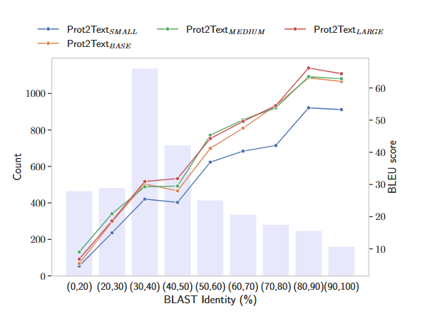
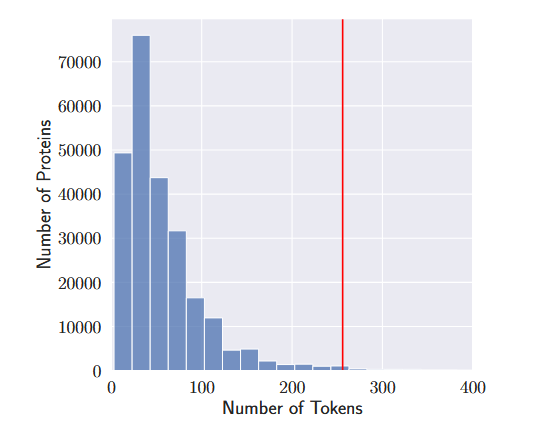

![Architecture of the proposed Prot2Text framework for predicting protein function descriptions in free text. The model leverages a multimodal approach that integrates protein sequence, structure, and textual annotations. The EncoderDecoder framework forms the backbone of the model, with the encoder component utilizing a relational graph convolution network (RGCN) to process the protein graphs, and an ESM model to process the protein sequence. A cross-attention mechanism facilitates the exchange of relevant information between the graph-encoded and the sequence-encoded vectors, creating a fused representation synthesizing the structural and textual aspects. The decoder component employs a pre-trained GPT-2 model, to generate detailed and accurate protein descriptions from the fused protein representation. By combining the power of Graph Neural Networks and Large Language Models, Prot2Text enables a holistic representation of protein function, facilitating the generation of comprehensive protein descriptions.](./img/prot2text/fig1.png)

## Expectation

- RGCN is not pre-trained
- Learning about BLEU、Rouge-1、Rouge-2 、Rouge-L  and Bert score
- Use the seq-structure-function pair dataset for Protein function task

## Method

### Graph Construction

> 使用 AlphaFold 获得 3D 蛋白质的结构后，我们继续将蛋白质表示为异质图 $G = （V,E,R）$，其中 $V = [N] := {1,...,N }$ 是代表蛋白质氨基酸的顶点集，$E ⊆ V × V$ 是代表节点之间各种相互作用的边集，R 是一组不同的边相互作用。每个节点 u 都与一个特征向量 $x_u ∈ R^d$ 相关联，包含相关信息，例如局部结构特征和相关氨基酸的理化性质。这使得图能够保留对蛋白质结构和功能至关重要的细粒度信息。为了模拟氨基酸之间的不同相互作用和关系，我们引入了连接节点的不同类型的边。因此，每个边 $i = （v， u）$ 都与边缘类型 $e_i ∈ R$ 相关联。顺序边缘用于连接蛋白质序列中的相邻节点，有效地表示氨基酸的顺序并捕获蛋白质一级结构的线性排列。这些顺序信息对于理解蛋白质内的折叠模式和功能基序至关重要。此外，我们利用空间边缘在蛋白质 3D 结构中空间非常接近的节点之间建立连接。这些边缘在编码蛋白质的三级结构和折叠模式方面发挥着关键作用，使我们能够捕获蛋白质核心内氨基酸的复杂空间排列。我们进一步扩展了图结构，将氢键相互作用作为额外的边缘类型。氢键是基本的非共价相互作用，对于稳定蛋白质结构和实现特定分子识别事件至关重要。通过整合不同的边缘类型，我们全面的蛋白质图可以更全面、更详细地描述蛋白质的结构，同时捕获短程和长程相互作用。

每个节点 `u` 都有一个特征向量 $x_u$。这个向量编码了与该氨基酸相关的多种信息：

- **局部结构特征**： 例如，主链的二面角、溶剂可及表面积等。
- **物理化学性质**： 例如，氨基酸的疏水性、电荷、大小、侧链特性等。

让图不仅包含连接关系，还包含节点本身的丰富信息，这对于理解蛋白质的结构和功能至关重要。

引入了三种不同类型的边来捕捉不同层面的相互作用

**序列边**

按照蛋白质的氨基酸序列顺序，连接相邻的氨基酸（即节点 `i` 连接到节点 `i+1`）。

- 保留蛋白质的**一级结构**信息。
- 捕捉蛋白质的线性排列顺序，这对于理解蛋白质折叠的起始点和功能基序至关重要。

**空间边**

在蛋白质的3D空间中，如果两个氨基酸在空间上足够接近（例如，它们的α-碳原子之间的距离小于某个阈值，如10埃），就用一条边连接它们。

- 编码蛋白质的**三级结构**和折叠模式。
- 捕捉氨基酸在三维空间中的复杂排列，这对于蛋白质的功能活性中心、核心疏水区域等至关重要。

**氢键边**

专门用于连接那些通过氢键相互作用的氨基酸对。氢键是蛋白质二级结构（如α-螺旋和β-折叠）的主要稳定力。

- 显式地建模对蛋白质结构稳定性至关重要的**特异性非共价相互作用**。
- 帮助网络更精确地理解局部的二级结构和全局的折叠稳定性。

### Graph Encoding

为了将蛋白质图 G 编码为向量 $h_G ∈ R_{d_{out}}$，我们采用了关系图卷积神经网络 （RGCN），该网络有效地考虑了消息传递机制中图中存在的各种边缘类型。我们用 $N_r（u）$ 表示顶点 u 的类型 r 的邻域，使得$ N_r（u） = {v :(v,u) ∈ E_r}$，其中$ E_r$ 是具有 r 边类型的边的集合。在 GNN 的 k 层中，我们更新节点表示如下：

$x_i^k=\sigma\left(W_{root}^k\cdot x_i^{k-1}+\sum_{r\in{R}}\sum_{j\in{N}_r(i)}\frac{1}{|N_r(i)|}W_r^k\cdot x_j^{k-1}\right)$

其中，$W_k$根表示k层中根变换的可学习权重矩阵，$W_r^k$表示关系$r$的$k$层的可学习权重矩阵，$σ()$是$ReLU$等元素激活函数。这种公式允许节点通过根据特定边缘类型合并来自相邻节点的信息来更新其表示，从而捕获蛋白质图中的结构和关系依赖关系。为了从GNN最后一层K的节点表示中获得图表示，我们应用了均值池化层，如下所示：

$h_G=\frac{1}{N}\sum_{i=1}^Nx_i^K$

生成的载体 $h_G$ 作为蛋白质图的信息编码表示，捕获基本结构和关系特征。这种表示在随后的文本生成过程中起着至关重要的作用，它将用于生成详细而准确的蛋白质功能。

### Sequence Encoding

为了编码蛋白质序列 $P_S$，我们使用 ESM2-35M作为我们的基础模型。ESM2 是一种蛋白质语言模型，它使用基于 transformer 的架构和注意力机制来学习输入序列中氨基酸对之间的相互作用模式。这使得 ESM 模型能够捕获有关蛋白质及其特性的氨基酸序列进化信息。为了实现空间域内所有模态的统一表示维度，在ESM模型的最后一个隐藏层之后应用投影层。该层充当投影层，将源自 ESM 嵌入维度的单个氨基酸表示转换为图嵌入维度。结果，形成了一个表示为$ H_S^0 ∈ R^{N×d_{out}} $的矩阵，其中包含氨基酸表示：

$ H_S^0=ESM(P_S)W_p$

其中$W_p$是一个可训练的矩阵，$W_p \in R^{d_{esm} × d_{out}}$

### MultiModal Fusion

为了获得最终的蛋白质编码，我们利用一个融合块，该模块将矩阵 $H_S^0$内每个氨基酸的表示与图表示向量$h_G$ 相结合。融合过程涉及两个表示的简单元素添加，然后是投影层。该融合块能够以简单的方式集成来自序列和图表示的信息。因此，允许每个氨基酸在上下文中丰富来自图表示的信息。此外，在每个融合块之后应用一个归一化层，以保持稳定的训练并进一步增强学习过程。具体来说，对于 $H_S^k$ 中的每个氨基酸表示和图表示 $h_G$，融合块计算组合表示 $H_S^{k+1}$，如下所示：

$H_S^{k+1}=(H_S^k+1_nh_GW_V^k)W_O^k$

其中 $W_V^k $和 $W_O^k$是融合块 $k$ 中的可训练矩阵，$1_n $是长度为 n（氨基酸序列长度），值为1的向量。通过在架构中多次使用该融合块（在本例中为四次），模型可以捕获序列和图表示之间的复杂交互和依赖关系，从而对蛋白质数据进行有效且上下文丰富的编码。当来自编码器的输入仅代表一个标记时，融合块可以被视为 transformer 交叉注意力块的特例。

### Text Generation

我们采用 Transformer 解码器架构来生成蛋白质描述。我们用GPT-2的预训练权重初始化了解码器的主要组件，即文本嵌入矩阵、自注意力和语言建模头。通过这样做，我们利用 GPT-2 模型的能力来掌握底层文本语义。我们将从蛋白质编码器获得的蛋白质表示作为输入转发到Transformer解码器内的多头交叉注意力模块。这种相互作用使模型能够有效地整合蛋白质表示中的上下文，有助于生成连贯且有意义的蛋白质描述。我们采用了 GPT2 模型中相同的词汇表和分词器，并引入了两个独特的特殊标记。这些额外的标记充当基本标记，使模型能够辨别输入文本中每个蛋白质描述的精确边界。在训练阶段，我们采用因果语言建模（CLM）作为训练目标来优化我们的模型。因果语言建模涉及训练模型以预测给定前面标记的序列中的下一个标记。这种单向预测过程确保模型以因果方式生成文本，而无需访问未来的标记。每个描述的最大长度为 256 个标记。

### Dataset

为了使用蛋白质的结构、序列和文本描述来训练 Prot2Text 框架，我们构建了一个包含 256690 种蛋白质的多模态数据集。对于每种蛋白质，我们都有三个关键信息：相应的序列、AlphaFold accession ID 和文本描述。为了构建这个数据集，我们使用了 SwissProt 数据库 ，这是 UniProtKB 联盟 （2016） 2022 04 版中唯一包含完整蛋白质文本描述的精选蛋白质知识库。最初，此版本中的 SwissProt 数据库有 568363 个蛋白质，我们对其执行以下操作：（1） 选择以下属性：给出蛋白质全名的名称、给出蛋白质氨基酸序列的序列、给出 AlphaFold 数据库中蛋白质的登录 ID 的 AlphaFoldDB、给出蛋白质文本描述的分类单元和文本。（2）剔除所有不具备全部三个关键信息的样本。（3）去除所有具有重复氨基酸序列的样品。（4）删除文本描述中包含“（按相似性）”的所有样本。（5）应用CD-HIT聚类算法创建分别包含248315、4172和4 203个蛋白质的训练/验证/测试方案。CD-HIT 算法中使用的（训练、验证检验）集之间的最大相似性阈值为 40%。（6）对文本描述进行预处理，删除“PubMed”信息。然后使用 AlphaFoldDB 种质下载“.PDB“文件格式，使用 AlphaFoldDB 的版本 4。

### Baseline

在我们的实验评估中，我们采用了一套全面的基线来严格评估 Prot2Text 框架的文本生成性能。具体来说，我们将我们的方法与单模态编码器（即 RGCN、ESM 和从头开始训练的普通 Transformer）进行了比较。这些编码器专门关注蛋白质图或蛋白质序列的表示。此外，我们将其与多模态基线 RGCN+ESM 进行了比较，后者连接图和序列表示，**而不融合每个氨基酸的表示和结构表示**。最后，我们将 RGCN × vanilla-Transformer 基线进行了比较，后者与 Prot2Text 具有相似的架构，但使用从头开始的 vanilla-Transformer 模型，而不是预训练的 ESM2。在所有 ESM 模型中，我们使用最后一个隐藏状态。vanilla-Transformer 基线遵循与预训练ESM2-35M相同的配置和参数数量。

### Metrics

在实验中，我们使用了几个指标来评估模型在文本生成任务中的性能。具体来说，我们使用了 BLEU Score ，这是一种广泛使用的评估机器生成文本质量的指标。它根据 ngram 测量生成的文本和参考文本之间的相似性。BLEU 分数越高表明生成的文本和参考文本之间的相似性越好。我们进一步使用了 Rouge-1、Rouge-2 和 Rouge-L 分数，它们分别测量生成文本和参考文本之间单元组、双元组和最长公共子序列的重叠。最后，我们使用了BERT Score，它使用基于Transformer的模型中的上下文化词嵌入来衡量生成的文本和引用文本之间的相似性。在我们的实验中，我们选择使用 BioBERTLARGE-cased v1.1  来计算 BERT 分数。

### Result

我们在表 1 中报告了不同编码器模型的结果，包括单模态编码器（如 vanillaTransformer、ESM2-35M 和 RGCN），以及多模态编码器（如 RGCN × vanilla-Transformer 和 RGCN + ESM2-35）。所有模型都使用 GPT-2 解码器。单vanilla-Transformer基线仅依赖于蛋白质的氨基酸序列，在所有评估指标中表现出最低的性能。然而，我们观察到使用单模态图编码器 RGCN 时性能显着提高。RGCN 在 BLEU 分数方面比 vanillaTransformer 高出 5 分以上，在 BERT 分数方面比 vanillaTransformer 高出 3 分以上。这种性能差异凸显了通过 RGCN 编码器整合结构信息以预测蛋白质功能的重要性。另一方面，利用预训练的蛋白质语言模型 ESM2-35M 而不是随机初始化 vanilla-Transformer，可以显着提高性能。与标准的普通 Transformer 配置相比，ESM2-35M 编码器可大幅提高超过 16 个 BLEU 分和 18 个 Rouge-L 分。这种显着的增强可归因于使用掩蔽蛋白质建模对 ESM2-35M 进行预训练，这使得编码器能够捕获蛋白质序列中复杂的关系和模式。在多模态蛋白质表示的背景下，评估结果表明 Prot2TextBASE 在所有评估指标上都表现出卓越的性能。值得注意的是，它获得了最高的 BLEU 分数 35.11、最高的 Rouge-1 分数 50.59、最高的 Rouge-2 分数 42.71、最高的 Rouge-L 分数 48.49 和最高的 BERT 分数 84.3。这些结果凸显了以多模态方式融合蛋白质结构和氨基酸信息的有效性。关系图卷积网络 （RGCN） 促进蛋白质结构与 ESM2-35 氨基酸的顺序表示相结合，显着提高了所有评估指标的整体性能。这一改进归因于通过这两种模式的协同作用对蛋白质的丰富理解。此外，从 RGCN × vanilla-Transformer 获得的结果证实了多模态融合方法的有效性。与单独使用普通 Transformer 相比，使用 RGCN 将结构信息引入随机初始化的 vanilla-Transformer 可显着提高 10 多个 BLEU 分数点，并且比单独使用 RGCN 提高 6 个 BLEU 分数点以上。最后，为了显示融合块在 Prot2Text 框架中的重要性，我们将其与 RGCN + ESM2-25 进行比较，后者将蛋白质结构表示与氨基酸表示连接起来。在这种情况下，图形表示将与 ESM 输出一起传递给解码器。我们注意到，使用此策略的结果比单独使用 ESM 的结果稍差。这不仅为选择 Prot2Text 中使用的融合块提供了支持，而且还表明不加区别地增加模型的总体参数数可能会导致其性能下降。

### Scaling to Larger Models

我们进行了一项消融研究，以评估 Prot2Text 框架的性能，因为我们改变了参数数量。该实验的主要目的是评估采用更大模型在生成更准确、更详细的蛋白质功能文本表示方面的好处。为了进行消融研究，我们系统地改变了蛋白质语言模型 （ESM） 的大小。其中 Prot2TextSMALL、Prot2TextBASE、Prot2TextMEDIUM 和 Prot2TextLARGE 分别使用 ESM2-8M、ESM2-35M、ESM2-150M 和 ESM2-650M。我们在同一组蛋白质测试上评估了每种配置，并使用了与前面描述的相同的评估指标。表 2 所示的消融研究结果显示，随着我们扩大模型架构，性能有所提高。较大版本的 ESM 在大多数评估指标上都优于较小的同类产品。模型大小的增加导致了更准确和相关的描述，表明在 Prot2Text 框架中利用更大的语言模型的好处。然而，包括相应计算时间在内的补充分析表明，使用更大的模型（参数数量增加）后推理成本会增加。因此，Prot2TextMEDIUM（398M 参数）是在性能和时间成本之间取得平衡的一个很好的权衡。此外，在图 2 中，我们报告了所有 Prot2text 模型在不同相似性阈值方面的性能。其中相似性表示使用 BLAST 标识的测试组和训练组的氨基酸序列之间的最高比对分数。我们观察到，对于与训练集相似性得分较低（20% 到 30% 之间）的测试蛋白质，以及训练集中没有对应物的蛋白质，Prot2TextMEDIUM 是主导的，而对于较高的相似性分数，Prot2TextLARGE 表现更好。

![Table 2: Test set results for different size variations of Prot2Text. Larger models outperform their smaller counterparts across most evaluation metrics, indicating the benefits of employing larger language models in the Prot2Text framework. The Prot2TextMEDIUM model, strikes an optimal balance between performance and computational efficiency. This configuration demonstrates improved performance compared to the smaller model while still maintaining reasonable computational costs. The inference time is in seconds for text generation of each model on the whole test set. The inference time here is computed during text generation using two NVIDIA RTX 6000 with 48GB memory in parallel and batch size of four per device.](./img/prot2text/table2.png)

### Visualization of Generated Descriptions

为了通过我们的 Prot2Text 框架更深入地了解生成的蛋白质功能的质量，我们在图 3 中提供了从测试集中选定的一组蛋白质的预定义标签和生成的文本输出的文本比较。它说明了三种不同蛋白质（P36108、Q8NG08 和 P35713）的基本事实和 Prot2Text 生成的相应描述之间的比较，以及每种蛋白质的名称、氨基酸序列和 3D 结构表示。结果表明，不同蛋白质的功能成功详细重建，包括比已知描述更丰富的信息。接下来，图 3 展示了该模型生成与基本实况注释紧密一致的连贯且信息丰富的自由文本描述的能力。

### Training Details

训练数据集由 256690 个具有独特氨基酸序列的蛋白质组成。然而，有些蛋白质有相同的描述。训练数据集总共有 48,251 个独特的功能描述。每个描述的平均token数为 57.51。我们选择在标记化期间将所有描述截断到最大长度 256，因为这个标记数量覆盖了所有描述的 98.7%，如图 4 所示。 分词器Prot2Text 分词器是 GPT-2 分词器的实例，具有两个额外的标记。在 GPT-2 模型中，pad token、序列的开始 token 和序列的结束 token 共享相同的索引。由于 Prot2Text 架构是一种编码器-解码器架构，因此我们选择通过添加两个额外的标记来分隔这三个标记，分别表示序列的开始和序列的结束。对于两个添加的标记，我们同样需要将相应的嵌入添加到 GPT-2 单词嵌入矩阵中，同时保持矩阵的其余部分完整。

### Source

Github：https://github.com/hadi-abdine/Prot2Text

Web server：http://nlp.polytechnique.fr/prot2text#proteins

Hugging face：https://huggingface.co/collections/habdine/prot2text-suite-66e48fe3596fcff3e41be4e7
