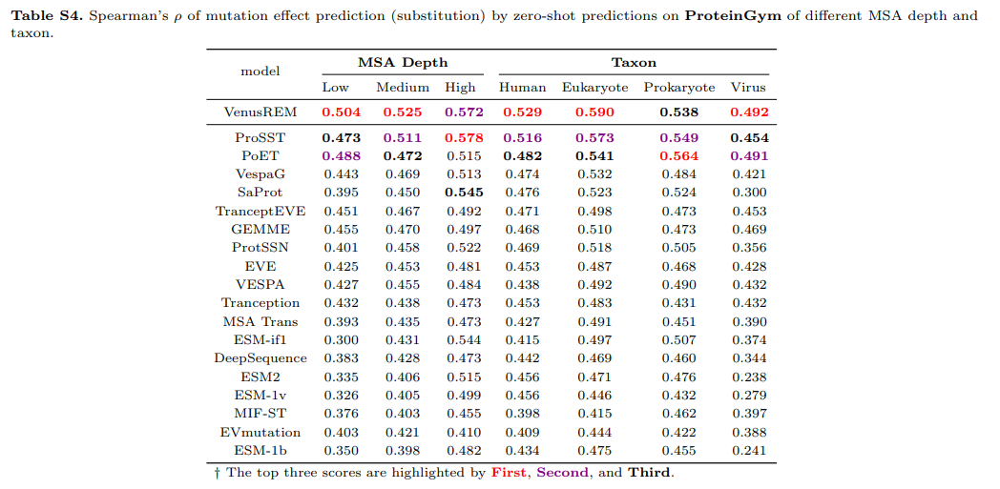

动机：酶工程是通过修饰野生型蛋白质来增强催化活性和热稳定性等特性来生产满足工业和研究需求的酶的关键方法。除了传统的定向进化和合理设计之外，深度学习的最新进展还提供了经济高效且高性能的替代方案。通过编码隐式的共同进化模式，这些预训练模型已成为强大的工具，其核心挑战是揭示蛋白质序列、结构和功能之间的复杂关系。 

结果：我们提出了 VENUSREM，这是一种检索增强的蛋白质语言模型，旨在捕获空间和时间尺度上的局部氨基酸相互作用。VENUSREM 在 ProteinGym 基准测试中的 217 次检测中取得了最先进的性能。除了高通量开放基准验证之外，我们还对 30 多个突变体进行了低通量事后分析，以验证该模型提高 VHH 抗体稳定性和结合亲和力的能力。我们还通过设计 10 个新的 DNA 聚合酶突变体并进行湿实验室实验来评估它们在高温下的增强活性，验证了 VENUSREM 的有效性。计算机和实验评估不仅证实了VENUSREM作为酶工程计算工具的可靠性，而且为未来突变效应预测的计算研究提供了全面的评估框架。

https://github.com/tyang816/VenusREM 

补充材料：https://oup.silverchair-cdn.com/oup/backfile/Content_public/Journal/bioinformatics/41/Supplement_1/10.1093_bioinformatics_btaf189/1/btaf189_supplementary_data.pdf?Expires=1763573535&Signature=RwBhhIoksIYTreWSThU1cwmKWxVWrfSI8UHWdHiTIap-ROAkAL4fzl1p8fzhzwWz64BRi7slEyDoxdyRxBYc0sQ2pD4NPB-HYlx3h0R3jSMt~b2vN0hugFD5HvCDqQHP0krEWviVi6OCJbJxM6zJS5LVKqr6fZfo9yOIxo23kWyO79ZaZMl9-r4~~r74PZ0zIADReEAjv~DqSJSTWwH3k1tRhHgjBWoYgEI~fYmPsSXUn5Gnm3zRnRN0K-AB0CXNvV32WONssRku82nmQUVIs7xd6cw1QNEG4KQkfsOuyGcgyZtzbDrOs2YqnM~n2Zir~LEZQzeuX4FIxESBn04Y7w__&Key-Pair-Id=APKAIE5G5CRDK6RD3PGA

**benchmark**

通常使用来自深度突变扫描 （DMS） 的高通量数据集进行评估，例如 ProteinGym（Notin 等人，2024 年）

目前还没有工作整合序列，结构，进化信息三种类型。此外，在纳入同源性信息时，现有方法要么需要额外的训练程序或缺乏即插即用灵活性

**结果验证：**

- 高通量测定的预测效果

  - Spearman系数

  Spearman 系数通常记为 **ρ（rho）**，其本质是：

  > “两个变量的秩次（排名）之间的皮尔逊相关系数”。

  也就是说，它不直接比较变量的原始值，而是比较它们的**排名**
   将两个变量 X 和 Y 的观测值分别转换为排名$ R(X_i) $和$ R(Y_i)$。
   计算每个样本点的排名差：

  $d_i = R(X_i) - R(Y_i)$
  代入公式：

  $\rho = 1 - \frac{6\sum d_i^2}{n(n^2 - 1)}$

  其中：

  - n：样本数量
  - $d_i$​：每对数据排名差

  $−1≤ρ≤1$

  - $ρ=1$：完全正相关（排名完全一致）
  - $ρ=−1$：完全负相关（一个排名越高另一个越低）
  - $ρ=0$：没有单调关系（但不一定线性无关）

  | 对比项         | Spearman ρ      | Pearson r      |
  | -------------- | --------------- | -------------- |
  | 数据类型       | 排名/次序型数据 | 连续、线性数据 |
  | 假设           | 不要求正态分布  | 要求线性、正态 |
  | 度量关系       | 单调关系        | 线性关系       |
  | 对异常值敏感性 | 较低            | 高             |

- 湿实验效果
  - 靶向生长激素纳米抗体VHH
  - 噬菌体phi29DNA聚合酶（phi29 DNAP）

架构

![Figure 1. Workflow of VENUSREM for predicting mutation effects. (a) For a given template protein, VENUSREM encodes structural, sequence, and MSA information to generate logits for each residue, which are used to calculate mutation fitness scores. (b) For each AA, its local structure is clustered into 2048 distinct structure tokens. (c) The vector representations of structural and sequence information are integrated using disentangled cross-attention through BERT-style pretraining. (d) Homologous information is retrieved via Jackhmmer and converted to a matrix representation of evolutionary logits.](./img/venusREM/p1.png)

对于给定的模板蛋白，VENUSREM接收三组输入：序列，结构和同源信息（图1a）。序列和结构输入由预训练的 PLM 进行标记化和处理，以生成单个蛋白质的原生表示（图 1b 和 c）。同时，根据与模板蛋白的序列和/或结构相似性鉴定的同源家族序列被总结并整合到模型中（图1d）。原生表示和进化表示都是 AA 位置和类型的矢量化描述。这些表示通过专门定义的评分规则进一步处理，以计算最终的突变适应度分数。

| 信息类型                 | 数据来源                      | 主要模块                | 输出                     |
| ------------------------ | ----------------------------- | ----------------------- | ------------------------ |
| 序列 (Sequence)          | 蛋白氨基酸序列                | Token embedding         | 序列向量 RRR             |
| 结构 (Structure)         | AlphaFold/PDB结构             | GVP + K-means 离散化    | 结构向量 SSS             |
| 同源信息 (Evolution/MSA) | 用 Jackhmmer 或 Foldseek 检索 | 频率矩阵统计 + logit 化 | 进化矩阵 OevoO_{evo}Oevo |

序列：

词汇表20个标准氨基酸+5中种特殊token（<pad>, <cls>, <eos>, <unk>, <mask>）

结构：

连续3d坐标转为离散token

- 对每个残基，取**10 Å 内最多40个邻居**，构造一个局部子图；
- 节点 = 残基；
- 边 = 空间距离 <10 Å；
- 每个局部结构 = 一个小图 $G_i$。

### 

- GVP 是一种专门为蛋白结构设计的神经网络；
- 输入：每个节点的几何信息（如 Cα 坐标、向量方向等）；
- 输出：每个残基的结构向量 $\pi_\theta(G_i) \in \mathbb{R}^{256}$。

GVP 的作用：

> 把3D几何关系（角度、距离）转化为不依赖坐标系的向量特征。

### 

- 用 4,735,677 个局部结构训练一个**自编码器**；
- 然后对连续空间中的结构向量做 **K-means 聚类**；
- 得到 **2048个“结构token”**（类似“结构词”）。

这样，每个残基就被赋予一个结构token编号（0~2047），最终结构输入：

$S \in \mathbb{R}^{L \times 2048}$

进化：

Jackhmmer 是 **HMMER 工具包**中的一个程序，

> 用于在大数据库中基于隐马尔可夫模型 (Hidden Markov Model, HMM) 搜索同源序列。

工作原理简化版：

1. 输入一个蛋白序列；
2. 构建 profile HMM（表示它的统计特征：每个位点常见哪些氨基酸、插入/缺口概率）；
3. 在 UniRef100 数据库中搜索相似序列；
4. 得到一个多序列比对 (MSA) 文件。

它会迭代（默认5次），不断扩充HMM模型，逐渐找到更远的同源序列。
 → 输出 `.a2m` 文件，即多序列比对（alignment）结果。

- 将 `.a2m` 中的小写字母转大写；
- 特殊符号（gap等）换成 `<pad>`；
- 得到一个 $N\times L$的矩阵 $A$（N条同源序列，每条长度L）。

计算每个位置出现各个氨基酸的频率：

$C_{iv} = \frac{\sum_n I(A_{ni}=v)}{\sum_v \sum_n I(A_{ni}=v)}$​

其中V是词汇表大小，N的序列数量，L是序列长度。如果第n条序列的第i个位置是v，则$I(A_{ni}=v)=1$

再转成对数形式：

$O^{evo}_{iv} = \log \frac{e^{C_{iv}}}{\sum_v e^{C_{iv}}}$

得到一个进化概率矩阵 $O_{evo}$：
表示“在自然进化中，这个位置出现氨基酸 v 的倾向性”。

| 编码类型     | 方法                              | 输出形状 | 特点               |
| ------------ | --------------------------------- | -------- | ------------------ |
| **序列编码** | One-hot + embedding               | L×25     | 直接表示氨基酸序列 |
| **结构编码** | 局部图 → GVP → K-means离散化      | L×2048   | 捕捉3D邻域结构     |
| **进化编码** | Jackhmmer 检索同源序列 → 频率统计 | L×25     | 融合保守性信息     |

融合打分，（论文设 α=0.8，即更信任进化信息）

$O_{iv}^{out}=(1−α)O_{iv}^{native}+αO_{iv}^{evo}$​

最后计算突变体适应度

$F_x = \sum_{t \in T}(O_{i,v'}^{out} - O_{i,v}^{out})$

其中：

- t：突变位置；
- v：原氨基酸；
- v′：突变后的氨基酸。

**Result**

所有基线方法中单个预测的汇总排名如图2a所示，个别分数详见补充图S3-S7。就达到最佳排名的检测数量而言，VENUSREM优于所有其他基线方法，具有最高的顶级排名计数（例如，前3名，由绿色条显示）和最少的较低排名计数（例如，10之后的排名，由红色条显示）。我们还检查了VENUSREM在不同同源序列检索策略下的性能（图2b）。

![Figure 3. Performance analysis on low-throughput experimental datasets. (a) Scatter plot of predicted fitness scores (by VENUSREM) versus experimentally obtained EC50 values. For both alkali resistance and binding affinity improvements, VENUSREM’s scoring of 31 VHH antibody mutants by 1–4 sites shows a clear correlation with experimental data. (b) Performance of different models on the two assays of VHH antibody data. Only VENUSREM successfully generated fitness scores that are moderately negatively correlated with EC50 values. (c) 3D structure of the template phi29 DNAP. The AA sites targeted for mutation across the 10 single-site mutants are highlighted and labeled with their wild-type residues. (d) Activity improvements in phi29 DNAP mutants. Among the 10 single-site mutants experimentally tested, 8 shows significant activity enhancements, with the top mutant exhibiting an eight-fold increase. (e) Thermostability of phi29 DNAP mutants. Three mutants demonstrate improvements in both thermostability and activity, with two of them showing significant gains.](./img/venusREM/p4.png)

图3a可视化了VENUSREM相对于实验结果的适应度预测分数（取自Kang等人（2025）。这里，每个点代表一个突变体，灰色五边形表示野生型模板。突变体根据突变深度进行颜色编码。总体而言，适应度预测分数与实验结果之间存在显著相关性。请注意，较高的 EC50 值表明对 VHH 的结合亲和力和耐碱性较差。因此，接近 − 1 的相关性表示更好的适应度预测。在图3b中，我们还将VENUSREM与其他流行的基于序列和结构的基线方法及其来自ProteinGym的最佳性能版本进行了比较。结果表明，大多数模型未能在适应度与两个实验指标之间建立负相关关系。尽管 ESM2 和 ESM1b 实现负相关，但这些值仍然接近于零，这表明这些模型在工程化 VHH 抗体方面的实际效用有限。

我们采用VENUSREM在较高温度（即42°C）下增强phi29 DNAP的活性。我们选择C3突变体作为进一步改进的模板，它是通过早期定向进化获得的具有高热稳定性的phi29 DNAP突变体。然而，它在 42 C （Fig. 3d） 的体外扩增过程中表现出较低的 ssDNA 产量，需要进一步增强（Povilaitis 等人，2016 年）。我们设计了 10 个来自 C3 的单位点突变，并使用 ssDNA 模板评估了它们在 42 C 下的 RCA 活性（图 3c）。三个独立重复的平均结果表明，其中八个突变体比 C3 表现出显着的活性增强，增加了三倍以上 （Fig. 3d）。表现最好的突变体phi29 DNAPY449G的活性提高了6.5倍。此外，我们使用DSF评估了突变体的热稳定性，观察到八个活性阳性突变体中的三个的Tm值明显增加（图3e）。值得注意的是，在定向进化中，通常存在活动和稳定性之间的权衡。然而，VENUSREM获得的phi29 DNAP突变体，如phi29 DNAPL567E和phi29 DNAPS551L，在两种测定中都同时表现出改进，为设计高性能变体提供了新的可能性。
